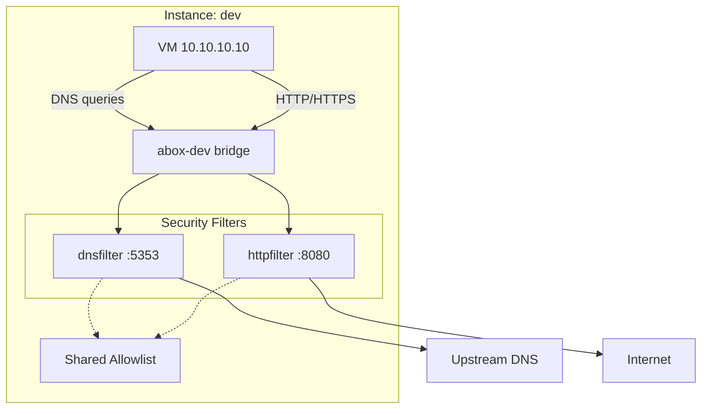

# Abox - Agent Sandbox

A CLI tool for creating and managing security-isolated VM environments for running AI coding agents with restricted network access.

## Features

- **Multiple Instances** - Run several isolated sandboxes simultaneously
- **DNS Allowlist** - Only permitted domains can resolve; all others return NXDOMAIN
- **HTTP Proxy Filter** - Domain-based filtering at the application layer with SSRF protection
- **Per-Instance Config** - Each instance has its own allowlist and settings
- **Provision Scripts** - Install packages via shell scripts (like Vagrant)
- **Protocol Restrictions** - Only HTTP/HTTPS via proxy; all other outbound blocked
- **LAN Isolation** - No direct network access; private IPs blocked by SSRF protection
- **Configurable Upstream DNS** - Use any DNS resolver (Google, Cloudflare, etc.)
- **Snapshots** - Create and restore VM checkpoints
- **Mount/Unmount** - SSHFS filesystem mounting
- **Port Forwarding** - Forward ports between host and guest
- **Agent Monitoring** - Tetragon-based process, file, and network event tracking
- **TLS MITM** - HTTPS inspection for domain fronting protection
- **Troubleshooting** - Built-in diagnostic commands

## Architecture



## Quick Start

```bash
# Build and install
go build -o abox ./cmd/abox
abox base pull ubuntu-24.04    # Or: abox base list  (to see all available images)

# Create and start an instance
abox create dev --cpus 2 --memory 4096
abox start dev

# Run provision scripts (install packages)
abox provision dev -s provision.sh

# Apply security restrictions (proxy only)
abox net filter dev active

# SSH into the VM
abox ssh dev
```

Or use the declarative workflow with `abox.yaml`:

```bash
abox init                # Generate abox.yaml
abox up                  # Create, start, and provision
abox down --remove       # Stop and delete
```

## Installation

**Requirements:** Linux with KVM/libvirt, Go 1.25+

```bash
# Debian/Ubuntu
sudo apt install libvirt-daemon-system qemu-kvm qemu-utils sshfs fuse3 genisoimage

# Build abox
go build -o abox ./cmd/abox

# Verify dependencies
abox check-deps

# Download base image
abox base pull ubuntu-24.04    # Or: abox base list  (to see all available images)
```

## Documentation

| Document | Description |
|----------|-------------|
| [Quickstart Guide](docs/quickstart.md) | Get started in 5 minutes |
| [abox.yaml Reference](docs/abox-yaml.md) | Declarative configuration format |
| [Provisioning](docs/provisioning.md) | Provision scripts and environment variables |
| [VM Access](docs/vm-access.md) | SSH, file transfer, and port forwarding |
| [Export/Import](docs/export-import.md) | Move instances between machines |
| [Security Design](docs/security.md) | Defense-in-depth architecture |
| [Filtering](docs/filtering.md) | DNS and HTTP proxy filtering |
| [System Requirements](docs/requirements.md) | Dependencies and compatibility |
| [Shell Completion](docs/shell-completion.md) | Tab completion for bash, zsh, fish |
| [Hardening](docs/hardening.md) | Host and guest security hardening |
| [Privilege Helper](docs/privilege-helper.md) | Setuid helper for passwordless operation |
| [Troubleshooting](docs/troubleshooting.md) | Common issues and solutions |
| [Claude Code Example](examples/claude/) | Example configuration for running Claude Code |
| [Claude Code on AlmaLinux](examples/claude-almalinux/) | Same example on AlmaLinux 9 (RHEL-based) |
| [GNOME Desktop Example](examples/gnome-desktop/) | Desktop environment with XRDP remote access |
| [OpenCode Example](examples/opencode/) | Example configuration for OpenCode |

For command help: `abox --help` or `abox <command> --help`
