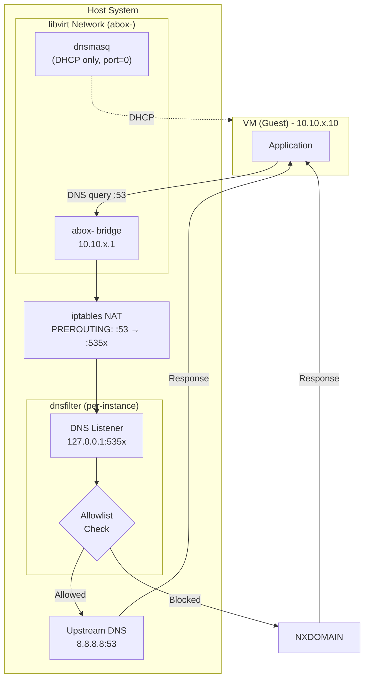
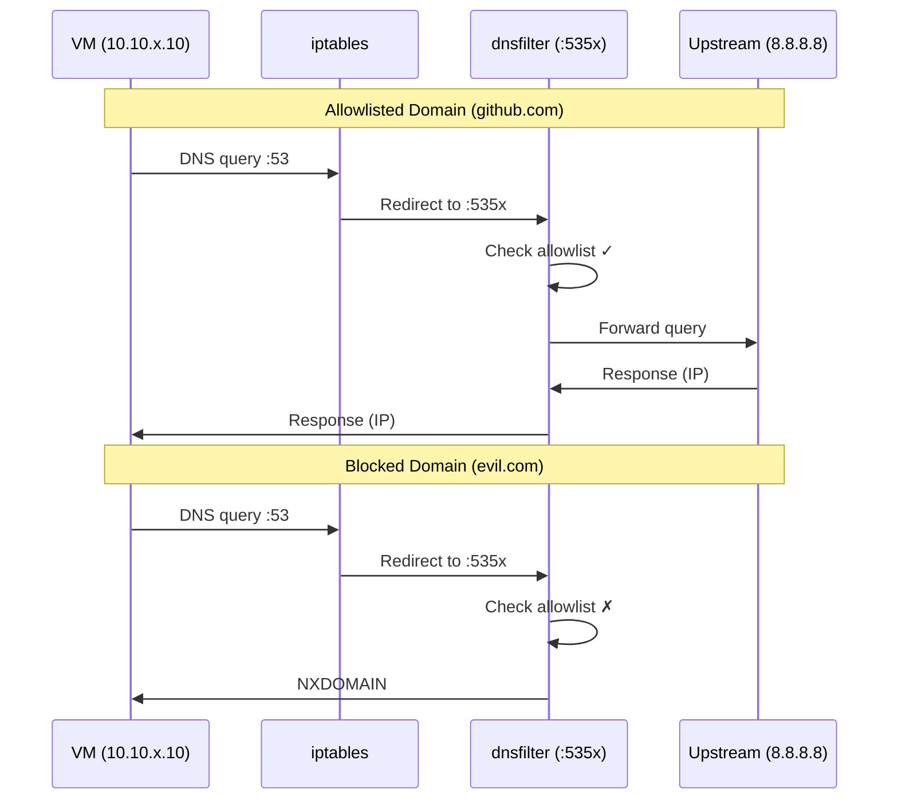
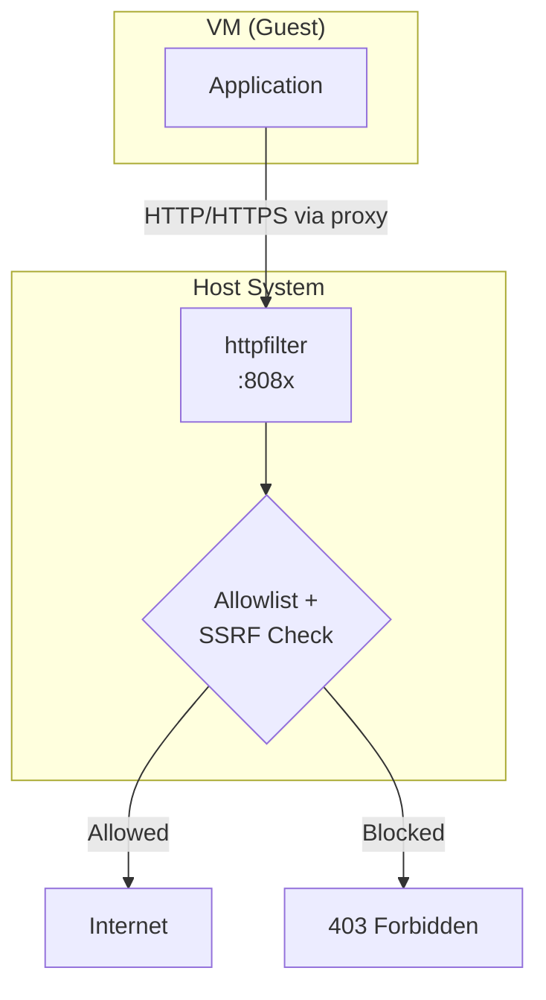
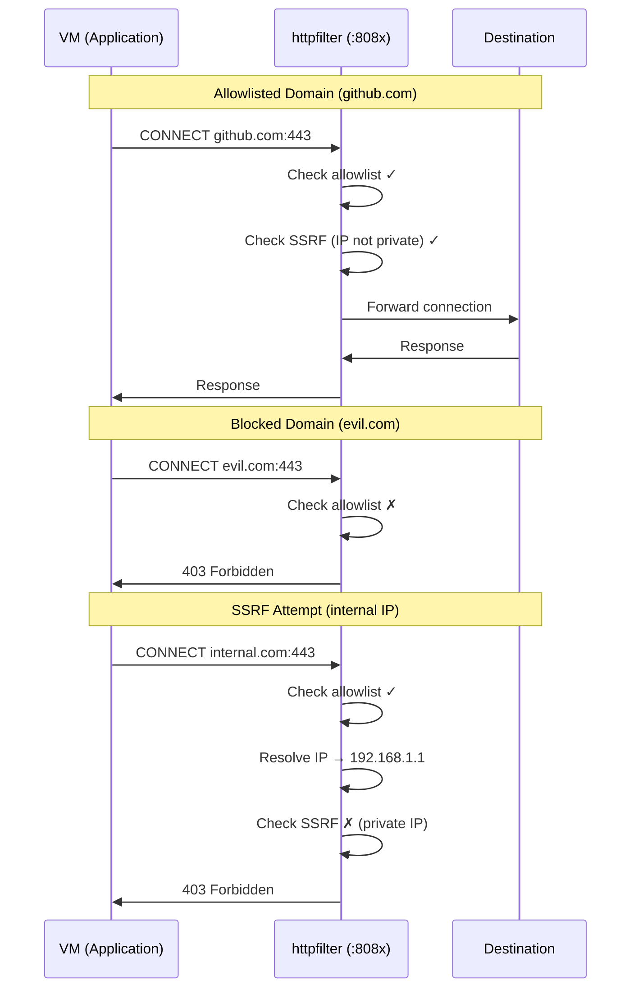

# Network Filtering in Abox

This document explains how DNS and HTTP/HTTPS proxy filtering work in abox.

## Overview

Abox uses two complementary filtering mechanisms:
1. **DNS filtering** - Blocks resolution of non-allowlisted domains
2. **HTTP proxy filtering** - Filters HTTP/HTTPS requests with SSRF protection

Both filters share a single allowlist file.

## DNS Architecture



### DNS Request Flow



## HTTP/HTTPS Proxy Architecture



The HTTP/HTTPS proxy provides additional security:

- **Domain validation** - Checks Host header against allowlist
- **SSRF protection** - Blocks requests to private IPs (10.x, 172.16.x, 192.168.x), loopback, and link-local addresses
- **DoH bypass mitigation** - Validates domains even if DNS was bypassed

### HTTP/HTTPS Request Flow



**Step by step:**
1. Application sends HTTP/HTTPS request through proxy
2. httpfilter extracts the Host header
3. Domain is checked against the shared allowlist
4. For allowed domains, destination IP is checked for SSRF
5. Blocked requests return 403 Forbidden
6. Allowed requests are proxied to the destination

## Component Responsibilities

### libvirt Network (abox-<name>)

Each instance gets its own isolated network:
- NAT-based networking for the VM
- dnsmasq for DHCP only (DNS disabled with `port=0`)
- Bridge interface: `abox-<name>`
- Unique subnet per instance (10.10.10.0/24, 10.10.11.0/24, etc.)
- Gateway at .1 address

### iptables NAT Rules

- Intercepts DNS traffic from VMs
- Redirects port 53 to instance's dnsfilter port (5353, 5354, etc.)
- Applied per-instance to isolate DNS filtering
- Set up automatically by `abox start`

### dnsfilter (integrated into abox)

Each instance runs its own dnsfilter process:
- User-space DNS server on unique port (5353, 5354, ...)
- Radix tree-based domain allowlist
- Hot-reload via Unix socket API
- Active/passive/profile mode toggle
- Managed automatically by abox start/stop

### httpfilter (integrated into abox)

Each instance runs its own httpfilter process:
- HTTP/HTTPS proxy on unique port (8080, 8081, ...)
- Shares allowlist with dnsfilter
- SSRF protection for private IP ranges
- Hot-reload via Unix socket API
- Active/passive/profile mode toggle
- Managed automatically by abox start/stop

### nwfilter (abox-<name>-traffic)

- Layer 2/3 packet filtering
- Default-deny: drops all outbound except allowed services
- In filtered mode: allows HTTP/HTTPS via proxy only
- In closed mode: blocks ALL outbound traffic
- Applied when instance is "filtered" or "closed"

## Default Allowlist

New instances have an **empty allowlist** — no domains are allowed by default. All outbound network access is blocked until you explicitly add domains:

```bash
abox allowlist add dev "*.github.com"
```

Or specify domains in your `abox.yaml`:

```yaml
allowlist:
  - "*.github.com"
  - "*.pypi.org"
```

Use `abox init` for an interactive setup that suggests common domains based on your selected features.

## Unified Allowlist Management

Both DNS and HTTP filters share a single allowlist:

```bash
# Add/remove domains (affects both filters)
abox allowlist add dev github.com
abox allowlist remove dev example.com
abox allowlist list dev
abox allowlist edit dev       # Edit in $VISUAL/$EDITOR
abox allowlist reload dev     # Reload both filters

# Set both filters to the same mode
abox net filter dev passive   # Allow all, capture domains
abox net filter dev active    # Enable blocking
```

The allowlist file location:
```
~/.local/share/abox/instances/<name>/allowlist.conf
```

### Allowlist Syntax

```conf
# Wildcard syntax (recommended for clarity)
*.github.com
*.pypi.org

# Plain syntax (equivalent - subdomains always allowed)
npmjs.org

# AI APIs
*.anthropic.com
*.openai.com

# CDNs
*.cloudflare.com
*.amazonaws.com
```

**Subdomain matching:**
- `*.github.com` or `github.com` → allows `github.com`, `api.github.com`, `raw.github.com`
- Sibling domains are NOT matched: `githubusercontent.com` requires its own entry
- Use `*.domain.com` syntax to make wildcard intent explicit

## Operating Modes

### Active Mode (Blocking)

Default mode. Non-allowlisted domains are blocked.

```bash
abox net filter dev active
```

### Passive Mode (Monitoring)

All queries/requests are forwarded but logged. Useful for discovering required domains.

```bash
abox net filter dev passive
```

### Domain Profiling

Passive mode captures all queried/requested domains for later review. Useful for building an allowlist.

```bash
# Enter passive mode (captures domains while allowing all traffic)
abox net filter dev passive

# Show captured domains from both filters
abox net profile dev show

# Export captured domains (merged and deduplicated)
abox net profile dev export >> ~/.local/share/abox/instances/dev/allowlist.conf

# Clear captured domains from both filters
abox net profile dev clear

# Count captured domains
abox net profile dev count
```

## Individual Filter Status

```bash
# Check DNS filter status and stats
abox dns status dev

# Check HTTP filter status and stats
abox http status dev
```

## Filter Log Levels

Adjust runtime log verbosity for filter daemons:

```bash
abox dns level dev              # Show current level
abox dns level dev debug        # Set to debug
abox http level dev warn        # Set HTTP filter to warn
```

Valid levels: `debug`, `info`, `warn`, `error`

## Filtering Log Output

Use `--jq` to filter JSON log output with jq expressions:

```bash
# Show only blocked DNS queries
abox dns logs dev --jq 'select(.action == "blocked")'

# Extract queried domain names
abox dns logs dev --jq '.query'

# Show HTTP requests to a specific domain
abox http logs dev --jq 'select(.host | test("github"))'
```

See [Troubleshooting: Filtering Logs](troubleshooting.md#filtering-logs-with---jq) for more examples.

## Security Considerations

DNS and HTTP filtering are part of a multi-layer security design. For the full defense-in-depth architecture, threat model, and known limitations, see [Security Design](security.md).

### Best Practices

- Keep allowlist minimal
- Use active mode in production
- Monitor blocked queries for suspicious patterns
- Regularly audit allowlist entries
- Use both DNS and HTTP filtering for maximum protection

## Troubleshooting

For troubleshooting DNS, HTTP proxy, and domain blocking issues, see the [Troubleshooting Guide](troubleshooting.md).

## See Also

- [Security Design](security.md) - Defense-in-depth architecture and threat model
- [Configuration Reference](abox-yaml.md) - Allowlist configuration in abox.yaml
- [Troubleshooting](troubleshooting.md) - DNS and HTTP filtering issues
