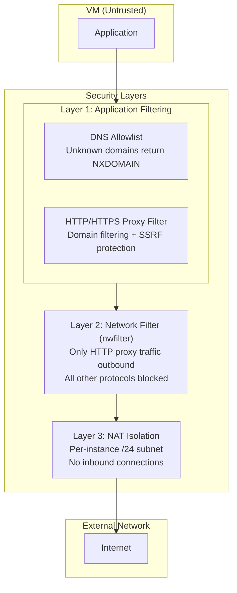
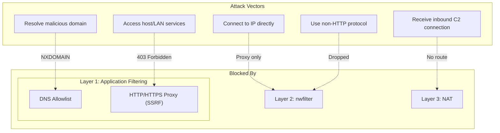

# Security Design

This document describes abox's security design goals and the defense-in-depth approach used to isolate AI coding agents.

## Overview

Abox is designed to sandbox autonomous AI coding agents that have shell access. These agents can execute arbitrary commands, making them a potential vector for:

- **Data exfiltration** - Sending sensitive data to external servers
- **Lateral movement** - Accessing other systems on the local network
- **Command and control** - Receiving instructions from remote servers
- **Resource abuse** - Using compute for unauthorized purposes

Abox addresses these threats through multiple security layers that work together.

## Threat Model

**Assumed Attacker Capabilities:**
- Full shell access within the VM
- Ability to install packages and run arbitrary code
- Knowledge of common bypass techniques

**Trust Boundaries:**
- The VM is untrusted
- The host system and local network must be protected
- Only explicitly allowlisted external services should be reachable

## Defense in Depth

Abox implements multiple independent security layers. Each layer provides protection even if other layers are bypassed.



### How Attacks Are Blocked



### Layer 1: Application Filtering

Layer 1 consists of two peer filters that share a unified allowlist. The **DNS filter** intercepts all DNS queries and returns NXDOMAIN for non-allowlisted domains. The **HTTP/HTTPS proxy filter** validates Host headers against the allowlist and blocks requests to private IPs (SSRF protection). Both support hot-reload and per-instance configuration.

For detailed architecture, request flows, and management commands, see [Filtering](filtering.md).

### Layer 2: Network Filter (nwfilter)

When an instance is "filtered" or "closed", libvirt's nwfilter applies packet-level restrictions.

In filtered mode, a default-deny approach allows only specific services:

```xml
<!-- Allow DHCP -->
<rule action='accept' direction='out'>
  <udp srcportstart='68' dstportstart='67'/>
</rule>

<!-- Allow DNS to gateway -->
<rule action='accept' direction='out'>
  <udp dstipaddr='GATEWAY' dstportstart='53'/>
</rule>

<!-- Allow HTTP proxy to gateway (filtered mode only) -->
<rule action='accept' direction='out'>
  <tcp dstipaddr='GATEWAY' dstportstart='PROXY_PORT'/>
</rule>

<!-- Allow ICMP to gateway -->
<rule action='accept' direction='out'>
  <icmp dstipaddr='GATEWAY'/>
</rule>

<!-- Drop everything else (default deny) -->
<rule action='drop' direction='out'>
  <all/>
</rule>
```

In closed mode, the HTTP proxy rule is omitted, blocking ALL outbound traffic except DHCP, DNS, and ICMP to the gateway. Private IP protection is handled by the HTTP proxy's SSRF protection.

### Layer 3: NAT Isolation

Each instance gets its own isolated network:

- **Unique /24 subnet** - e.g., 10.10.10.0/24, 10.10.11.0/24
- **NAT for outbound** - VM traffic is NATed through the host
- **No inbound** - External systems cannot initiate connections to the VM
- **Separate bridge** - Each instance has its own bridge interface

## Filtering Approaches

Abox provides two complementary filtering mechanisms (DNS and HTTP proxy), both sharing the same allowlist. Use both for defense in depth — the HTTP proxy catches requests that bypass DNS filtering (e.g., DoH). For detailed architecture and operating modes, see [Filtering](filtering.md).

## Input Validation

Abox validates all user-controlled inputs to prevent injection attacks:

### Instance Name Validation

```
Pattern: ^[a-zA-Z][a-zA-Z0-9_-]{0,62}$
```

- Must start with a letter
- May contain letters, numbers, underscores, hyphens
- Maximum 63 characters
- Used safely in libvirt names, paths, and iptables rules

### MAC Address Validation

```
Pattern: ^([0-9A-Fa-f]{2}:){5}[0-9A-Fa-f]{2}$
```

- Standard colon-separated format
- Validates before use in XML

### XML Escaping

All user-controlled values are HTML-escaped before inclusion in libvirt XML templates, preventing XML injection attacks.

**Note:** Custom domain templates (via `overrides.libvirt.template`) bypass the default hardened template. XML escaping of template variables is still applied, but the template itself controls VM configuration. See [Hardening](hardening.md) for what the defaults provide.

## Known Limitations

### DNS-over-HTTPS (DoH) Bypass

Applications that use DNS-over-HTTPS can bypass DNS filtering:
- DoH queries go to HTTPS endpoints (port 443)
- These are allowed by the nwfilter
- The DNS allowlist cannot intercept encrypted DNS

**Mitigation:** The HTTP proxy filter validates the destination domain at
connection time, providing a second layer of protection. Requests to
non-allowlisted domains are blocked even if DNS was bypassed.

### Direct IP Connections

If an attacker knows the IP address of a service:
- They can attempt direct connections without DNS
- The nwfilter blocks all direct connections (only proxy traffic to gateway allowed)
- The HTTP proxy blocks requests to private IPs (SSRF protection)

**Mitigation:** Direct IP connections are blocked at the network layer. Even via the proxy, private IPs are blocked.

### Passive Mode

Passive mode allows all traffic for discovery/debugging — never use it with untrusted workloads. See [Filtering: Operating Modes](filtering.md#operating-modes) for details.

### Healthcheck Domain

The domain `healthcheck.abox.local` receives special handling in both filters:
- DNS filter returns `127.0.0.1` for this domain regardless of mode or allowlist
- HTTP filter returns `200 OK` for requests to this domain regardless of mode or allowlist

This exists to support diagnostic tooling and health checks. No external connection is made - both filters return static responses directly. This domain cannot be used for data exfiltration.

## Security Monitoring (Tetragon)

Abox optionally integrates [Tetragon](https://tetragon.io/) for runtime security monitoring inside the VM. Enable it with `monitor.enabled: true` in `abox.yaml` or `--monitor` on `abox create`.

When enabled, the monitor daemon streams security events from the VM via virtio-serial:

- **exec** — Process execution (binary path, arguments, UID)
- **file** — File access events (path, operation)
- **net** — Network connection events (destination, port, protocol)

The monitor daemon runs independently — if it fails, the instance continues operating normally. View events with:

```bash
abox monitor status dev    # Check if monitor is running
abox monitor logs dev      # View event stream
```

## Traffic Capture (tap)

Abox can capture raw network traffic from an instance's bridge interface for offline analysis or IDS monitoring:

```bash
abox tap dev                   # Live decoded output
abox tap dev -o capture.pcap   # Save to file
```

Because the HTTP proxy performs TLS interception, `abox tap` also exports the TLS session keys so tools like Wireshark and Suricata can decrypt HTTPS traffic in the capture. The key file is written to `logs/keys.log` in the instance directory.

```bash
# Decrypt a saved capture
tshark -o tls.keylog_file:~/.local/share/abox/instances/dev/logs/keys.log \
  -r capture.pcap -Y http
```

DNS traffic is unencrypted on the bridge and requires no key file. HTTPS decryption requires MITM to be enabled (the default).

Requires `tcpdump` to be installed on the host.

## Best Practices

For operational best practices (allowlist management, mode selection, profiling workflow), see [Filtering: Best Practices](filtering.md#best-practices).

## See Also

- [Hardening](hardening.md) - Host-side VM hardening and guest hardening guidance
- [Filtering](filtering.md) - DNS and HTTP filter implementation details
- [Configuration Reference](abox-yaml.md) - Security-related configuration options
